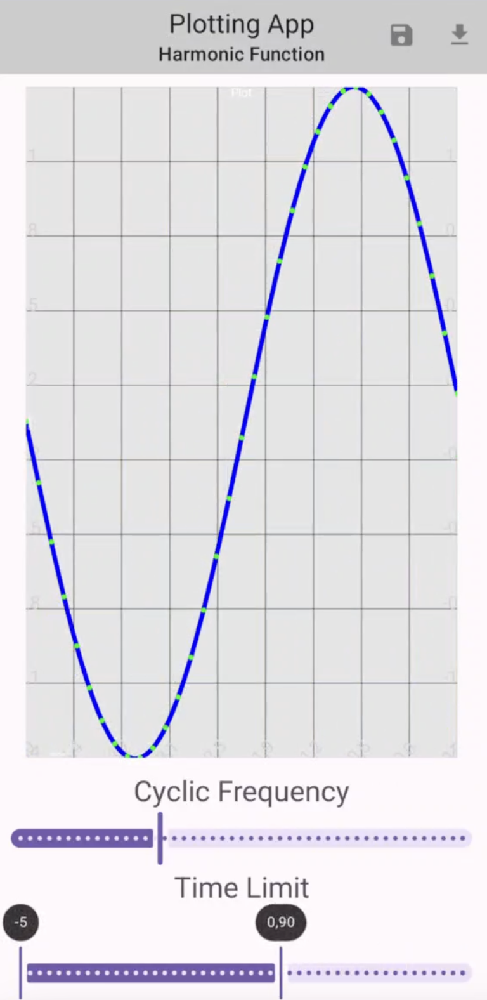

# :iphone: Android Course

  

This repository contains the source files for the "Introduction to Android Development" final project assignment.

## :pencil2: Task

Plot a graph of the function

$$
y(t) = \sin \omega t + \cos \omega t
$$

where the user can specify the value of $\omega$ and the range of $t$. 

The graph should be updated in real-time as the user changes the value of $\omega$ or the range of $t$.

## :sparkles: Main features

Besides the main task, the application also includes the following features:
- Shared preferences to save the last entered values of $\omega$ and $t$ range.
- A button to reset the values of $\omega$ and $t$ range to the default ones.
- A button to download the $\omega$ and $t$ range values as a `.json` file.
- A button to upload the $\omega$ and $t$ range values from a `.json` file with the pop-up confirmation window.
- Adaptable optimized plot of the function $y(t)$.

## :camera: Screenshots

  

